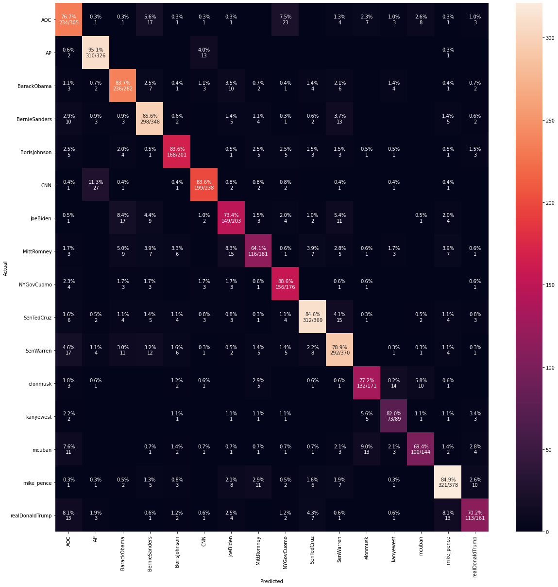
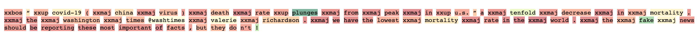
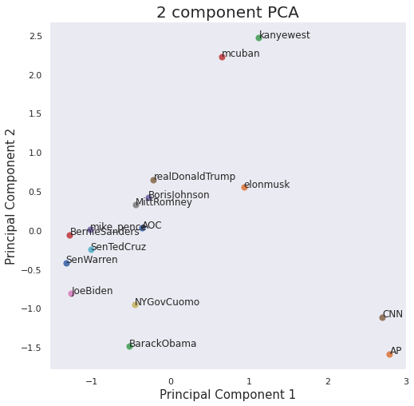
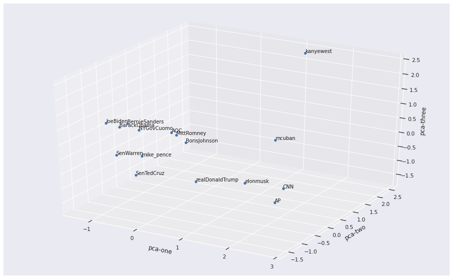

# Project-X

## Vision

This project was designed to foster a community where we vote not based on opinions created by biased media, fake-news, and political bots, but from the very source - the words of the politicians themselves. Twitter has become an ubiquitous platform when it comes to expressing political opinion and addressing the general population. We've seen millennial politicians such as @AOC having 7 million followers online while global leaders threaten each other publicly and with no shame - it's remarkable what one can do with just 150 characters.

With Twitter being used increasingly these days, courtesy of Covid-19 and 2020 Elections, it's obvious that the platform contains a lot of insights that would be relevant to one's decision making while voting in November. This project serves to be the spoon with which one takes in Twitter data.

## Structure

Most of the important modeling code is in `Politician Embedding Extraction.ipynb`. I have created some helper functions to pull the tweets which is also in the same notebook. The Research folder contains some initial unfinished code for Sentiment Analysis using Google NLP modules. The `Callbacks.ipynb` notebook also has some modeling code around creating `fastai` callbacks to save the activation mean and std values for diagnosis. I've also added code which uses `rapids` to perform t-SNE decomposition of all the Tweets to see how they're clustered. I didn't get a change to analyze the clusters in depth or to visualize the keywords in each cluster which would nicely finish the analysis up.
## Ideas

### Politician Embeddings

The first idea that we are working on is to train a language model, 'AWD_LSTM' from fastai. Using a ton of political data, we will train the model to predict the next word and in the process, create word embeddings which will be adjusted for the political context.

Next, using those embeddings, we train a classification model to predict which politician said a given tweet. We can then extract the last layer of the network to create embeddings for each politician.

Below is a visualization of the final output of the LSTM classifier.

We can see that most of the individuals can be recognized by the model just based on their tweets.
It incorporates information such as:
* Words used
* Emojis used
* Style of writing (capitalized letters, words, or sentences, etc.)

Here is an example of a Tweet by Donald Trump - which the important `features` highlighted:

With the vector representation of a particular political rep, we can then perform some dimension reduction and plot them to see how they align with each other.
For this, I used the weights of the second to last layer (last layer being the output, the prediction) and performed PCA on it. The idea was that, for each Politician's account, the parameters or weights that we multiply the output of the previous layers with, would be different. And here is what we finally got:

**In 2 dimensions**

**In 3 dimensions**

Overall, with 2 dimensions, we could only capture about 40% of the total variance so the plot is not the best representation, but we can still see some pattern in terms of the politicians taking the left stage, being clustered together, while the news accounts like @AP and @CNN are together in the bottom right.

### Future State
These embeddings can then be used to perform semantic analysis - such as extracting their political views from their embeddings by performing some transformation and mapping the results back to their initial weights, etc.

It would also be interesting to perform some sort of sentiment analysis on the tweets to extract the sentiment with respect to a certain topic - such as vaccination or guns.

Twitter is rich with data and its a shame we don't have more people analyzing what's being shared on it.
